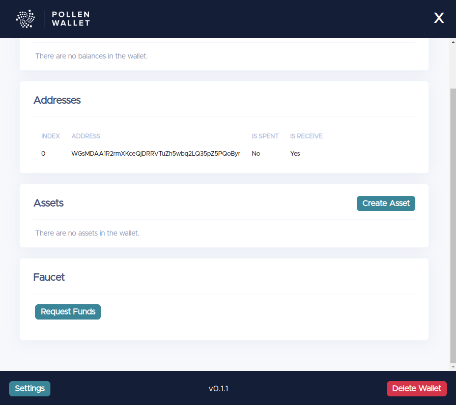

# How to obtain tokens from the faucet

## The faucet dApp
The faucet is a dApp built on top of the [value and communication layer](../apis/communication.md). It sends IOTA tokens to addresses by listening to faucet request messages. A faucet message is a Message containing a special payload with an address encoded in Base58, the aManaPledgeID, the cManaPledgeID and a nonce as a proof that some Proof Of Work has been computed. The PoW is just a way to rate limit and avoid abuse of the Faucet. The Faucet has an additional protection by means of granting request to a given address only once. That means that, in order to receive funds from the Faucet multuple times, the address must be different.

After sending a faucet request message, you can check your balances via [`GetAddressUnspentOutputs()`](../apis/ledgerstate.md).

## Obtain tokens from the faucet
There are 3 ways to send a faucet request message to obtain IOTA tokens:
1. Via the Go client library
2. Via the HTTP API directly
3. Via the wallet

### Via the Go client library
Follow the instructions in [Use the API](../apis/api.md) to set up the API instance. 

Example:
```go
// provide your Base58 encoded destination address,
// the proof of work difficulty,
// the optional aManaPledgeID (Base58 encoded),
// the optional cManaPledgeID (Base58 encoded)
messageID, err := goshimAPI.SendFaucetRequest("JaMauTaTSVBNc13edCCvBK9fZxZ1KKW5fXegT1B7N9jY", 22, "2GtxMQD94KvDH1SJPJV7icxofkyV1njuUZKtsqKmtux5", "2GtxMQD94KvDH1SJPJV7icxofkyV1njuUZKtsqKmtux5")

---- or

// invoke go get github.com/iotaledger/goshimmer/client/wallet for wallet usage
// get the given address from a wallet instance and
connector := wallet.GenericConnector(wallet.NewWebConnector("http://localhost:8080"))
addr := wallet.New(connector).Seed().Address(0)
// use String() to get base58 representation
// the proof of work difficulty,
// the optional aManaPledgeID (Base58 encoded),
// the optional cManaPledgeID (Base58 encoded)
messageID, err := goshimAPI.SendFaucetRequest(addr.String(), 22, "2GtxMQD94KvDH1SJPJV7icxofkyV1njuUZKtsqKmtux5", "2GtxMQD94KvDH1SJPJV7icxofkyV1njuUZKtsqKmtux5")
```

### Via the wallet
Currently, there is one cli-wallet that you can refer to the tutorial [Command Line Wallet
](wallet.md) and two GUI wallets to use. One from the community member [Dr-Electron ElectricShimmer](https://github.com/Dr-Electron/ElectricShimmer) and another from the foundation [pollen-wallet](https://github.com/iotaledger/pollen-wallet/tree/master). You can request funds from the faucet with these two implementations.

As for pollen-wallet, follow the instructions in [pollen-wallet](https://github.com/iotaledger/pollen-wallet/tree/master) to build and execute the wallet, or download executable file directly in [GoShimmer wallet release](https://github.com/iotaledger/pollen-wallet/releases).

You can request funds by pressing the `Request Funds` in the wallet.

**Note**: You need to create a wallet first before requesting funds.




This may take a while to receive funds:


When the faucet request is successful, you can check the received balances:


